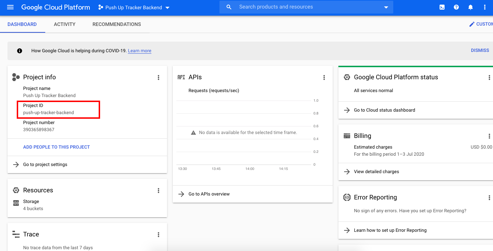
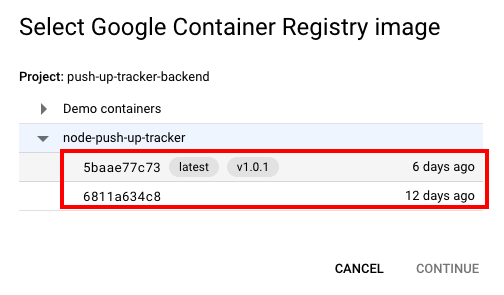
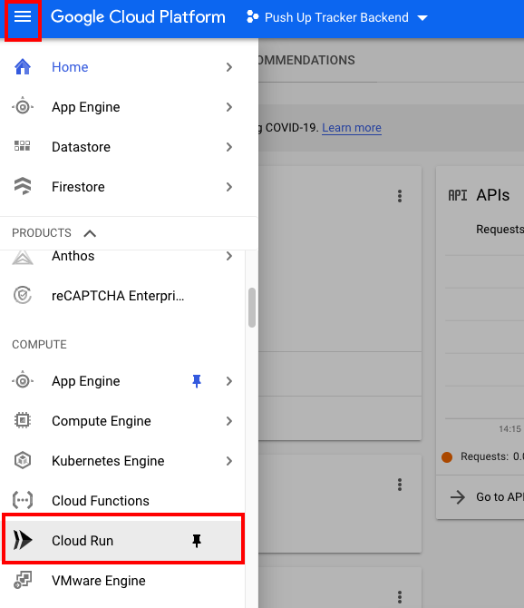
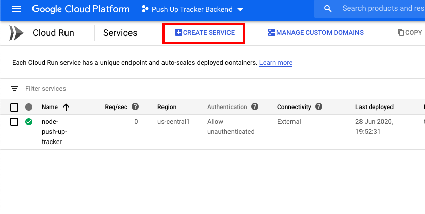
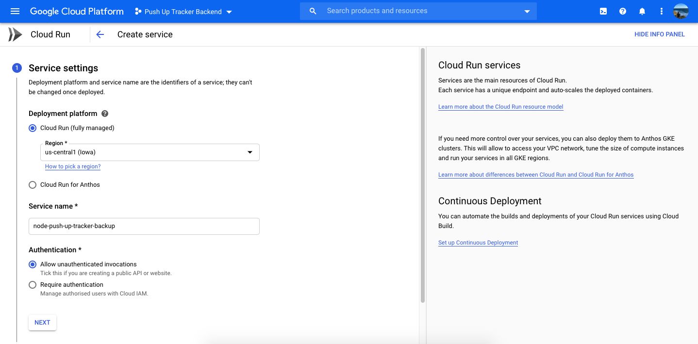
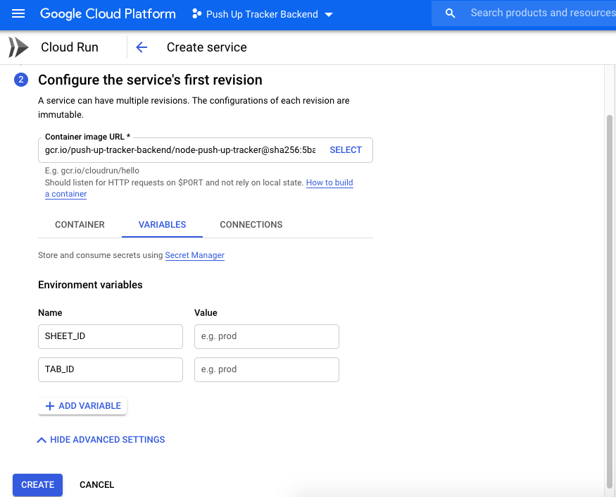
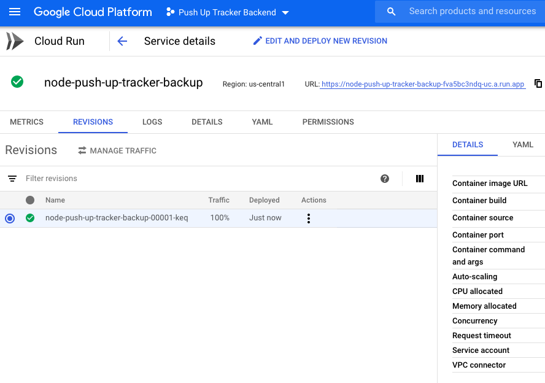
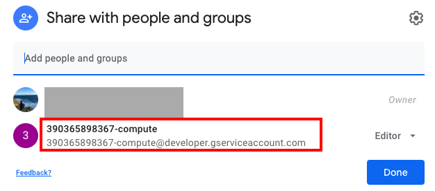
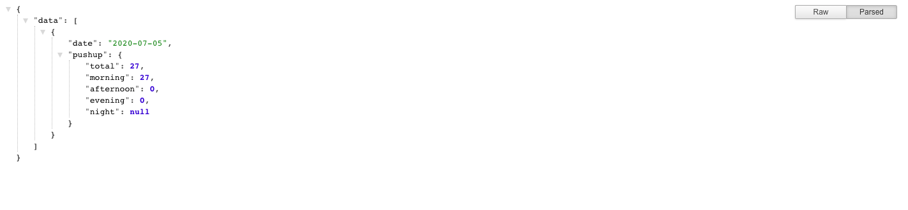

This post discussed Why and How I Build REST API using Google Sheets.

## Problem Statement

In my previous [article](https://medium.com/@tcguy/how-i-did-thousand-push-up-in-30-days-ea215be265fa?source=friends_link&sk=9c7982524f9a87bb26bc7de89fdfb05d), I wrote about How I Build My Push-up Habit and I utilize Google Sheets for daily logging purposes. Google Sheets is where I keep track of my push up. 

However, I want to be able to visualize my push-up and I decided to build data visualization chart using my own data. Without further ado, I swiftly explore the idea, discover the possibility, and finalized my objectives.

Here is the list of results that I want to achieve and I organized them into both **Key Result** (Must Have) and **Bonus Points** (Good to Have).

### Key Result

- Build a REST API where I can retrieve the push-up count given the start date and end date. For e.g, I shall be able to retrieve my push-up count from 01-Jun-2020 to 30-Jun-2020. 

### Bonus Points

- I am not required to move my push-up data which is already in the Google Sheets.
- High Availability. In the midst of developing my REST API, I can still continue to log my push-up record and do not require to insert my push-up data manually after the development completed.

As I do not want to introduce more effort in logging my push-up, if we can build something on top of the current flow, it will be the best scenario for me.

-------

## Solution Design

While I am researching for the solution, I stumble upon the Serverless Toolbox Series by Google. It has several great examples and one of them is precisely fit to solving my problem.

In laymen term, I can deploy my Express app into Cloud Run and it can leverage Google Sheet API and retrieve my push-up data seamlessly.

Hereby I summarized the benefits of using Cloud Run are:

- Build REST APIs to retrieve my push-up data using Express Framework. ✅
- I don't need to migrate my existing push-up data. ✅
- I can continue using Google Sheets to record my push-up data and it will be fine even in the future. ✅
- Extra benefits: I don't have to manage the server.

Some knowledge of Docker is undoubtedly helpful in this solution. However, even you do not have knowledge in Docker like me, you can still nail it and get things done.

------

## Solution Implementation

Since we have decided on our solution, let’s figure out how we can do it step by step and I summarized the heuristic version of the whole solution implementation.

1. Creating a Project in Google Cloud Platform and Enabled Billing. ( P/S: Please do remember Cloud Run is pay-per-use, but however there is a free tier. Google will not charge you as long as your usage does not exceed. At this moment when I am writing this article, my billing is still zero dollars. )
2. Create a Node project and install the Express framework.
3. Write the business logic and Create the API Endpoint.
4. Install `googleapis` dependency.
5. Perform authentication using GoogleApis and retrieve Google Sheets data.
6. Create a basic Dockerfile on how to start your application.
7. Build your container image and submit it to Cloud Run.
8. Deploy Your Container
9. Grant Permission to the Compute Engine to access your Google Sheets.

Although I have mentioned the heuristic/brief version of the solution implementation, I would like to document some of the highlights I mentioned above for reference as well.

Thus, if you’re stuck on any particular step, feel free to read the details at the next section.

**Step 2: Create Node Project and Install Express Framework**

```bash
mkdir node-push-up-tracker
// Change directory to the created project folder 
cd node-push-up-tracker
// Create Node Project
npm init -y
// Install Express Framework
npm install express
```

**Step 3: Write the business logic and Create the API Endpoint**

We will create two endpoints in this step. The first endpoint is to retrieve today push-up while the second endpoint is to retrieve the push-up within the date range.

```javascript
// pushupController.js
const pushupService = require('./pushupService');

/**
 * Controller to retrieve today's push up
 */
exports.getTodayPushup = async (req, res) => {
    try {
        const todayDate = new Date();
        const result = await pushupService.getPushUpByDate(todayDate, todayDate);
        return res.json({ data: result });
    } catch (err) {
        return res.status(500).json({ errors: err });
    }
};

/**
 * Controller to retrieve push-up from [dd/mm/yy] to [dd/mm/yy]
 */
exports.getPushupWithDate = async (req, res) => {
    try {
        const { from, to } = req.query;
        if (!from || !to) {
            return res.status(400).json({ errors: ['Please specify "from" and "to" in the url'] });
        }
        const result = await pushupService.getPushUpByDate(from, to);
        return res.json({ data: result });
    } catch (err) {
        return res.status(500).json({ errors: err });
    }
};
```

```javascript
// router.js
const express = require('express');
const router = express.Router();
const pushupController = require('./pushup/pushupController');

router.get('/pushup/today', pushupController.getTodayPushup);

router.get('/pushup', pushupController.getPushupWithDate);

module.exports = router;
```

**Step 5: Perform authentication using GoogleApis and retrieve Google Sheets data**

We will create the `pushupService.js` where it responsible to retrieve Google Sheets Data. But before that, we will have to perform authentication using `googleapis` library.

```bash
// Install Googleapis dependency
npm install googleapis
```

```javascript
// pushupService.js
const { google } = require('googleapis');

/**
 * Perform authentication with google sheet and retrieve spreadsheet data
 * @returns {[Array]} - 2d array
 */
exports.retrieveDataFromSpreadSheets = async () => {
    const auth = await google.auth.getClient({
        scopes: ['https://www.googleapis.com/auth/spreadsheets']
    });
    const api = google.sheets({version: 'v4', auth});
    const response = await api.spreadsheets.values.get({
        spreadsheetId: process.env.SHEET_ID,
        range: `${process.env.TAB_ID}!A:F`
    });
    // Col 0 - Date
    // Col 5 - Total Pushup  
    return response.data.values;
}
```

**Step 6: Create the basic Dockerfile on how to start your application**

In this step, I copy the basic `Dockerfile ` on how to start the Node application.

```bash
# Use the official lightweight Node.js 12 image.
# https://hub.docker.com/_/node
FROM node:12-slim

# Create and change to the app directory.
WORKDIR /usr/src/app

# Copy application dependency manifests to the container image.
# A wildcard is used to ensure both package.json AND package-lock.json are copied.
# Copying this separately prevents re-running npm install on every code change.
COPY package*.json ./

# Install production dependencies.
RUN npm install --only=production

# Copy local code to the container image.
COPY . ./

# Run the web service on container startup.
CMD [ "npm", "start" ]
```

**Step 7: Build your container image and submit to Cloud Run**

In this particular step, we will build the container image and submit it using `gcloud` command. If you have yet to install `gcloud`, please refer to the [installation guide](https://cloud.google.com/sdk/docs/downloads-interactive).

Before we start, you would have to know your Google Project Id. Go to Google Cloud Console and select your project. You will be able to notice the **Project Id** in the Project Info section. Refer to the screenshot below.

****

Let's build the container image now and submit to Cloud Run. I have written a bash script for the build process to avoid keep on repeating to type the build command which I am always forgetting and end up need to refer to the documentation again.

```bash
# build.sh
# Build the container 

GOOGLE_PROJECT_ID=push-up-tracker-backend // Replace this with your Google Project ID
CONTAINER_IMAGE_NAME=node-push-up-tracker // Replace this with your desired container image name

gcloud builds submit --tag gcr.io/$GOOGLE_PROJECT_ID/$CONTAINER_IMAGE_NAME \
  --project=$GOOGLE_PROJECT_ID
```

Run the build script via `sh build.sh`.

What this build script did are: 

- It will assign your Google Project Id to the `GOOGLE_PROJECT_ID` variable and use this variable to identify this container image is belong to which project. 
- Besides, you would have also named the container image under `CONTAINER_IMAGE_NAME` variable. Thus, if you're using the same container image name, each build process will generate a revision for you. Refer to the screenshot below where I have 2 revisions since I submit the built image twice.




**Step 8: Deploy Your Container**

Let's deploy the container image you have built and submitted. For your information, you can actually deploy the container image using the `gcloud` command too. However, I would like to show how you can deploy the service using Google Cloud Platform website and it is easy.

1. Go to your Google Cloud Console and Select the Project that you have created. 

2. Click on the Navigation Menu, and click the Cloud Run within the navigation menu. (You can also refer to the red box in the screenshot below.)

   

3. You shall be able to see the Cloud Run Services screen, where you can create the service using the container image you have built. Each Cloud Run services have unique endpoint. 

4. Let's create a new service by clicking on **Create Service**.
   

5. Fill in the input field like deployment platform, service name, and authentication and click "Next" when you have done. You can refer to the example below.
   

6.  Select the container image you have built by clicking **Select** and you should see a list of built container images.

7. Before we click **Create**, click on the **Variables** tab to add environment variables if you have any. In my use case, I would need to add `SHEET_ID` ad `TAB_ID` so it knows which spreadsheets and which tab it should retrieve the data form.
   

8. Click on **Create** and your service will be created and deploy. You shall see the screen below if your service is successfully created and deployed. You can verify by calling the API endpoint you created with the URL.
   

**Step 9: Grant Permission to the Compute Engine to access your Google Sheets**

If you have followed the step until here and tried to call the API, you might have to get permission denied issue from accessing the Google Spreadsheets. By default, you’re the only one who can access your Google spreadsheets due to security and privacy concerns.

Thus, we can copy the Compute Account where we found in the **Permissions** tab, and add it to the spreadsheets sharing. Now, you will be able to successfully retrieve the spreadsheet data. Refer to the screenshot below.

 





Now, you should have a working Express Application you should be able to retrieve the total push up from spreadsheets.

Here is the screenshot where I successfully retrieved my push up data.



## Conclusion

Here are the key points of this article.

- We built the REST API using Google SpreadSheets as the data source for the purpose of data visualization.
- We discussed the benefits of build REST API using Spreadsheets where it allows high-availability and it won’t affect my daily pushup logging process during the development.
- We go through the steps and also particular step details from creating the project and deploying it via Google Cloud Console.

Thank you for reading. Complete source code is available at [Github](https://github.com/tlcheah2/node-push-up-tracker).

## References

- If you prefer the video tutorial, Google has a and detailed video for the whole tutorial on [Youtube](https://www.youtube.com/watch?v=hLcfAznirWg).

