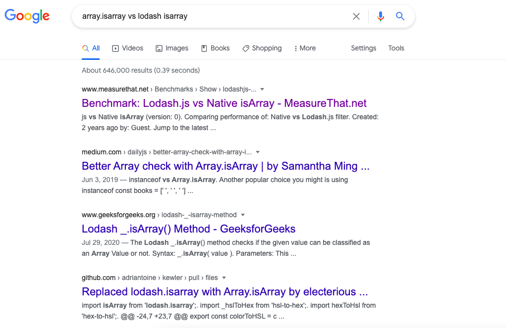
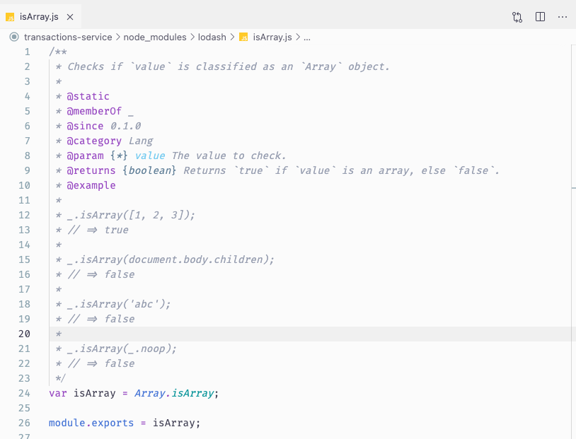

This post talked about one of my experiences in code review and ultimately lead me to the discovery of the difference between `Array.isArray` and Lodash `_.isArray`. Without further ado, let’s start the story.

### Introduction

The story starts by beginning sending a merge request for review in Gitlab. It is similar to the pull request you known in Github.

In the code itself, I am using lodash `isArray` to check the variable. Refer the below code snippet.

```jsx
const { isArray } = require('lodash');

const requiredFields = getRequiredFields();

if (isArray(requiredFields)) {
	return requiredFields;
} else {
	// do something else
}
```

At this moment, the reasons that I use lodash here is because

- It come to my mind 1st - That's human instinct.
- Secondly, `lodash` was already installed and used in my project that moment.

However, when my peers started to review my code, he raised a very good question which I myself never considered until that moment. 

> Why use lodash instead of native array check `Array.isArray()` ?

It was this question that lead me to the later discovery and I really appreciate the question by my peer which inspire me to do the later study. 

## Research & Investigation of isArray

I started off by trying the keyword "Array.isArray vs lodash isArray". Apparently, there are also a special group of folks who questioning the same things as me.

The screenshot below show the search results. You would be able to see there is even a performance benchmark between them which created 2 years ago.



However, I decided to dig into the Lodash's source code to discover the truth myself. Finally, I found the below code snippet in Lodash. From the code snippet below, I found out that the `isArray` function in Lodash is actually using the native `Array.isArray` as well. 

Thus, this actually tell us that is no difference between using lodash `isArray` and `Array.isArray` in you code as they're both leading to the same implementation anyway. 

After this discovery, I can share with the people who're struggling about this and told me that you shouldn't use the `isArray` from lodash, the performance for the native `Array.isArray` is far more better & optimized. **Nah!!! They're the same things after all.**



## Conclusion

From the discovery, there is no difference between `isArray` from lodash library and native built-in `Array.isArray` since they're both however lead to the same implementation. 

However, there is one point I want to highlight over here. You shouldn't choose to install `lodash` just to use `isArray` even they're are using the same implementation, because the greater concern here is you just added a dependency to your project, but you can use that functionality without installing it. 

Thank you for reading and see you in the next article.