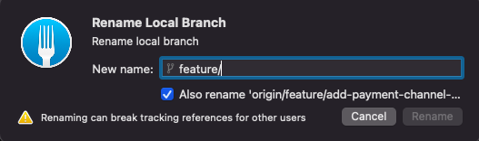

## Introduction

The above screenshot is the Git client - [Fork](https://git-fork.com/) which I used daily basis for commit code, writing my commit message, and etc.

1. Right click a branch
2. Choose "Rename".
3. Type in your new desired branch name 
4. Just tick the checkbox and it helped you change your local branch name and remote branch name. ( Like the screenshot above )

However, I am wondering how the branch rename work under the hood. Is it as easier as what  the UI flow showed us or what we saw was just the abstract of the complex work? 

If you interested in what is the action under the hood for the branch rename, then this post might be helpful to you. Without further ado, let's start.

## Rename Branch Under the Hood

For this section we would separate it two parts.

- Rename a local branch (Easiest one)
- Rename a remote branch

### Rename Local Branch

Rename a local branch was easier and it can simply just done using a single command.

`git branch -m old_branch new_branch`

For e.g, you would like to a local branch named **feature/payment** to **feature/deposit**. Here is the command you need to run.

`git branch -m feature/payment feature/deposit`

### Rename Remote Branch

If you already push your branch to the remote, which means your code repository in the cloud. Then you need more steps to rename the local & remote branch

1. Perform a local rename
2. Push the latest renamed local branch to remote 
3. Delete the old remote branch

Now, you shall realized rename a remote branch is similar to create a new branch with new name, after that delete the old branch. Let's see how we do it via the CLI.

```bash
# 1.) Rename a branch
git branch -m old_branch new_branch

# 2.) Push latest renamed local branch to remote and reset upstream
git push origin -u new_branch

# 3.) Delete the old remote branch
git push origin -d old_branch
```

Something worth mention here is the 2nd command `-u` options. It basically allow you to reset your new branch upstream tracking. Otherwise, it would still tracking the old_branch as remote upstream.

## Conclusion

Lastly, you might think do I need to really know this complicated command stuff? Why not just use the Git client. 

- Right click, type something, tick the checkbox and click the button. ( Boom, all done ✅ )

Well, it's really depend on your preference. It's just like everyone have their own preference.

- Some like hot & spicy food
- Some like to eat chicken breast ONLY.

So feel free to have your own preferred ways of doing stuff. However, CLI command allows you to use git command in server environment where you do not have the User Interface.

I hope you enjoy this article and I will see you in next article.

## References

- No 1 Google Search [Article](https://linuxize.com/post/how-to-rename-local-and-remote-git-branch/) in How to Rename Branch
- Hostinger [Tutorial](https://www.hostinger.my/tutorials/how-to-rename-a-git-branch/) on How to Rename Branch