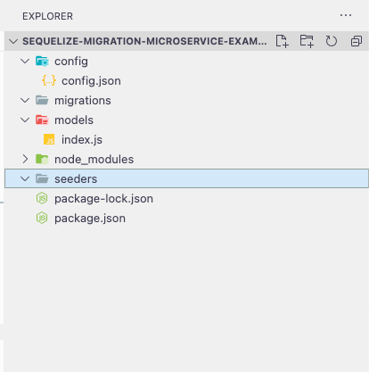
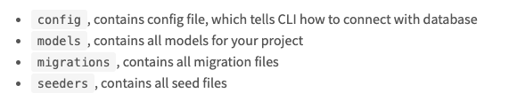
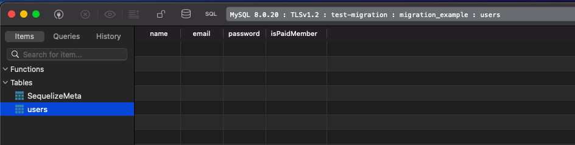
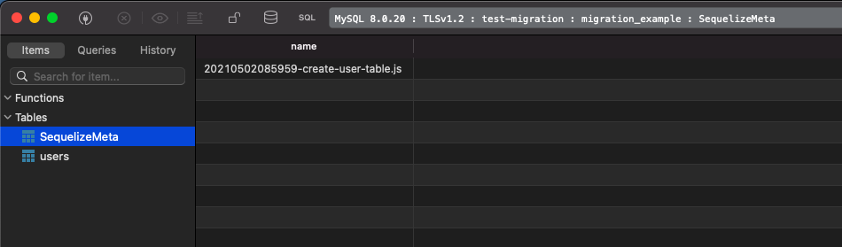
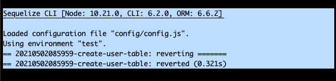
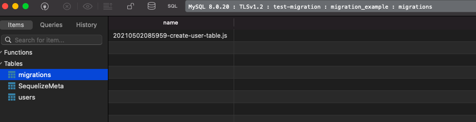

## Introduction

Once upon a time, I am having a conversation with Joe regarding setting up a migration script repository for microservice-based architecture. Here is how the conversation goes:

Me: Hey Joe, we're using [Sequelize](https://sequelize.org/) in our code. But how about our migration? Since we're using microservice-based architecture if we write our migration file in each service, wouldn't it hard to manage, and the scripts are scattered everywhere.

Joe: Erm... You probably right. How about we set up a repository called **migrations**. Where we will centralize all the migration scripts in that repo. So we could have an overview of all the changes in a single repository. What do you think?

Me: That sounds like a good idea. Let's start looking & work this out.

---

## Step-by-Step Guide

Before we go through the step-by-step guide from scratch, let's have a high-level overview of what we will be having.

- A Node Project with `sequelize-cli` dependencies
- `models` folder which contain all the model to the table. We shall always have the latest model structure here so the whole team will check on the repository for the latest table structure.
- `migrations` folder which contain all the migration script generated using `sequelize-cli` and the changes to the database which coded by the developers.

Without further ado, let's start dive into the details.

### Step 1 - Bootstrap the project

Here are the commands on how we bootstrap the project and `sequelize-cli` library provides the bootstrapping command which we can consider it as the boilerplate of the migration repository.

`gist:tlcheah2/db5881587866240f13ba72c114acd9e3`
<!-- [https://gist.github.com/](https://gist.github.com/tlcheah2/db5881587866240f13ba72c114acd9e3) -->

The command above will create the folder named `config`, `migrations,` and `seeders` folder. Below is the screenshot of what your project would look like:

The sequelize [documentation](https://sequelize.org/master/manual/migrations.html) also provides a very straightforward explanation of what these folders do. Below is the screenshot of each folder's description.

Now, we have our boilerplate code ready. Next, we will have our environment variable ready so we could select to run the migration script in different environment.

Let's go to Step 2.

---

### Step 2 - Dynamic Configurations Setup with Environment Variables

As you may notice, the configuration is written in `json` format. With json format, we unable to achieve dynamic configurations setup, meaning every time if you need to change the database name, credentials or even other configuration. You're required to make code change & commit source code to the repository. 

Thus, we can setup using dynamic configurations with the below instructions.

- Create a file named `config.js` inside the *config* folder
- Create a file named `.sequelizerc` in the root directory. The purpose of this file is to override the default config location to `config.js`. The default config file is `config.json`
- Create the environment file named `.env` as we will be using [dotenv](https://www.npmjs.com/package/dotenv) library to load the environment config in local test. (This step could be optional if you're using other tools such as pm2) or etc.
- Next, we will install [dotenv](https://www.npmjs.com/package/dotenv) library and initialize it to load the environment variable into `config.js`

Without further ado, let's go through each of them in details.

`gist:tlcheah2/417467b6b65ff5b7ca57f8c44c48449f`

Now paste the below content into the `config.js`. In the example below, I am using MySQL database. Feel free to your own preferred database such as Postgresql or other relational database.

`gist:tlcheah2/08ea4bc1385c13821ef1ad78a9d1ff1e`

 
Next, we will have the edit the content of `.sequelizerc` to override the config file location from the default location, `config/config.json` to `config/config.js`.

`gist:tlcheah2/3551265a0534a5732af99eabb5128af4`

In the last part of this step, we will create `.env` file in your local environment and define your database credentials. In addition, we also define the `NODE_ENV` env variable, this variable should match with the key you define in `config.js` . For e.g, if you defined `test` for NODE_ENV, thus, the sequelize-cli will use the config defined in `test.`

Furthermore, you should not commit this file to the repository for best security practices. So your database credentials would not expose to everyone who has access to the repository.

> Tips⭐️⭐️ : You can add `.env` file into your `.gitignore` so your Git CLI & client could help to ignore this file so you won't accidentally commit it to your repository.

Here is the sample of how my `.env` file looks like. I have defined only the database credentials for the test environment in the sample env file.

`gist:tlcheah2/96f3aad8cc4723ba61c35eb7dbf990cd`

---

### Step 3 - Verifying the Dynamic Configuration Setup

In this step, we will try to create a simple table via the migrations to verify the migration is successfully run in the repository.

We can verify the setup by follow the instructions below.

- Create the migration script template using `sequelize-cli`
- Complete the above created script by creating users table. Create the table with several columns
- Run the migration command & ensure the migration script is successfully executed.

Without further ado, let's dive into each of them.

`gist:tlcheah2/0d98f62c475d43fbbe54b751ad520667`

After we create the migration script using the command above, you shall be able to see there is a `.js` file created inside the *migrations* directory. Now, let's proceed to add the migration command - create table and rollback command - delete the table. Below is an example of how the migration script looks like:

`gist:tlcheah2/c54ef8d77e5ad06f98fe2cd0d113cd11`

Next, we will run the migration script by running the command below.

`gist:tlcheah2/803dcf1e09f14f2b0f4af9283730ba38`

Now let's verify the migration script is successfully executed. You shall see the new *users* table created. And also the migration script is stored inside the `SequelizeMeta` table by default. Refer to the screenshot below.

---

### Step 4 - Optional Configurations (Optional)

Now we already have the fully functional migration repository. But we can have more extra configurations such as:

- Changing the migration storage table name
- Changing the seeders storage table name

In this step, we will try to change the migration storage table name from the default, `SequelizeMeta` to `migrations`. Let's dive into it.

By default, sequelize stores the migration script name in the `SequelizeMeta` table so it can keep track of which migration has executed and which is not. However, we could change the default migration storage table name to something we prefer, in this example, we will change it to `migrations`.

Before we change the migration table name, let's roll back the changes we did in Step 3 by running the command below.

`gist:tlcheah2/d1e547b9a8c68c013c02d1abd01d6902`

You shall see the below screenshot for successful rollback.

After the successful rollback, start by editing the `config.js`. We will be adding the `migrationStorageTableName` key into the test config. Below is an example of the `config.js` after edit.

`gist:tlcheah2/6acd4ce43182caa8d2582d89327fe7c9`

After the edit, we can now run the migrate command and now you shall see the migration script executed and the new `migrations` table is created and our migration script name is recorded in the table. Refer to the screenshot below.

 

Now our migration script is stored inside the migrations table.

## Conclusion

In this post, we created a centralized repository for migration purposes where it stored all the migration script and latest model files. The purpose of having a centralized repository is to resolve the problem of migration scripts scattered in different microservice. 

In addition, we also dive into details:

- Bootstrapping the migration repository
- Using dynamic configuration setup for different environment with environment variables
- Verifying the setup is correct by creating a simple migration script
- Override the default migration storage table name

Last but not least, you can get full source code of the migration repository [here](https://github.com/tlcheah2/sequelize-migration-microservice-example).

I hope you find this post helpful and I will see you in the next article.

Thank you.

## References

- Sequelize Migration [Documentation](https://sequelize.org/master/manual/migrations.html)