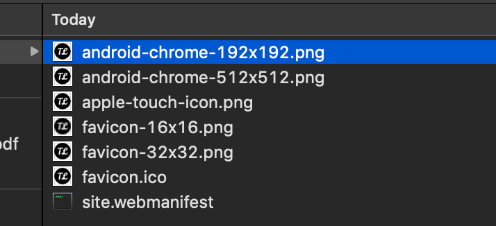

## Adding Favicon in 2 steps

Adding Favicon in Gatsby PWA is easy and you can just do it within 2 steps.

1. Install Gatsby manifest plugin. 

   `npm install gatsby-plugin-manifest`

2. After the plugin installation, add the plugin into `gatsby-config.js` with the configuration below.

   ```javascript
   // in gatsby-config.js
   module.exports = {
     plugins: [
       {
         resolve: `gatsby-plugin-manifest`,
         options: {
           name: `Your website name`,
           short_name: `Youe website short name`,
           start_url: `/`,
           background_color: `#f7f0eb`,
           theme_color: `#a2466c`,
           display: `standalone`,
           // Here is where you adding favicon the favicon relative path
           // Recommended to use the highest resolution (512x512) for best quality 
           icon: `src/images/icon.png`
         },
       },
     ],
   }
   ```

## Advantages

The **advantages** of using this plugin to add favicon is because it will help you to generate a pre-configured set of favicon with different sizing like the picture below.



## Conclusion
In short, using this plugin save you time spending in favicon configuration.