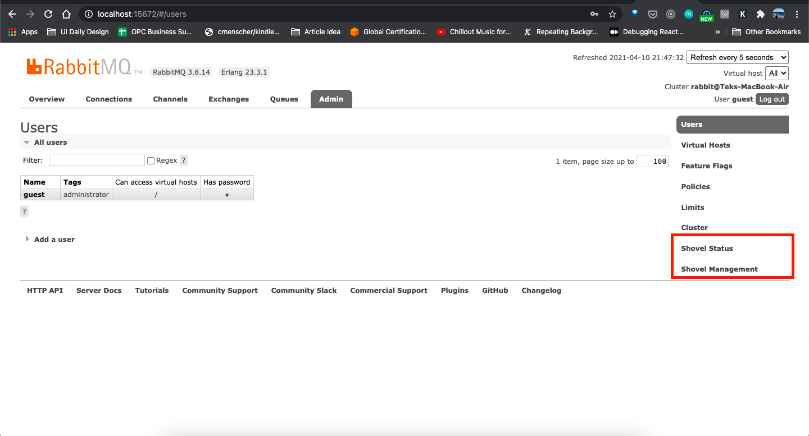

Photo by [Gary Bendig](https://unsplash.com/@kris_ricepees)

## Introduction

Hello folks. Welcome back to another article. 

In this post, I will share with you steps to enable a RabbitMQ Plugin using RabbitMQ CLI tools. 

Here are some prerequisites required to have before you continue:

- You must already have RabbitMQ installed.
- RabbitMQ CLI tools are working.

Without further ado, let's start.

## Step by Step Guide

Here is the concise version on How to Enable RabbitMQ Plugin:

1. Run command `rabbitmq-plugins list` to list all the available plugins.
2. Find the name of the desired plugin from the list.
3. Enable the plugin using command `rabbitmq-plugins enable plugin_name`. 
4. If a plugin is not found from the list or if it is custom plugin, download the plugin and copy the plugin file into the rabbitmq plugins folder. Follow step 1 to step 3 again. ( I might do another short post for custom plugin next time )
5. Lastly, verified the plugin is function as expected.

### Step 1: List all available rabbitmq plugins

Run `rabbitmq-plugins list` to display all the available plugins. You shall see the screen like the below. 

```bash
rabbitmq-plugins list
Listing plugins with pattern ".*" ...
 Configured: E = explicitly enabled; e = implicitly enabled
 | Status: * = running on rabbit@localhost
 |/
[E*] rabbitmq_amqp1_0                  3.8.14
[  ] rabbitmq_auth_backend_cache       3.8.14
[  ] rabbitmq_auth_backend_http        3.8.14
[  ] rabbitmq_auth_backend_ldap        3.8.14
[  ] rabbitmq_auth_backend_oauth2      3.8.14
[  ] rabbitmq_auth_mechanism_ssl       3.8.14
[  ] rabbitmq_consistent_hash_exchange 3.8.14
[  ] rabbitmq_event_exchange           3.8.14
[  ] rabbitmq_federation               3.8.14
[  ] rabbitmq_federation_management    3.8.14
[  ] rabbitmq_jms_topic_exchange       3.8.14
[E*] rabbitmq_management               3.8.14
[e*] rabbitmq_management_agent         3.8.14
[E*] rabbitmq_message_deduplication    0.5.0
[E*] rabbitmq_mqtt                     3.8.14
[  ] rabbitmq_peer_discovery_aws       3.8.14
[  ] rabbitmq_peer_discovery_common    3.8.14
[  ] rabbitmq_peer_discovery_consul    3.8.14
[  ] rabbitmq_peer_discovery_etcd      3.8.14
[  ] rabbitmq_peer_discovery_k8s       3.8.14
[  ] rabbitmq_prometheus               3.8.14
[  ] rabbitmq_random_exchange          3.8.14
[  ] rabbitmq_recent_history_exchange  3.8.14
[  ] rabbitmq_sharding                 3.8.14
[  ] rabbitmq_shovel                   3.8.14
[  ] rabbitmq_shovel_management        3.8.14
[E*] rabbitmq_stomp                    3.8.14
[  ] rabbitmq_top                      3.8.14
[  ] rabbitmq_tracing                  3.8.14
[  ] rabbitmq_trust_store              3.8.14
[e*] rabbitmq_web_dispatch             3.8.14
[  ] rabbitmq_web_mqtt                 3.8.14
[  ] rabbitmq_web_mqtt_examples        3.8.14
[  ] rabbitmq_web_stomp                3.8.14
[  ] rabbitmq_web_stomp_examples       3.8.14
```

### Step 2 & 3: Find the desired plugin & Enable the plugin

In this post, we will enable `rabbitmq_shovel` and `rabbitmq_shovel_management` as an example. Let's try to enable both plugins using the command `rabbitmq-plugins enable`.

RabbitMQ CLI tools allows you to enable multiple plugins in a single command:

```bash
▶ **rabbitmq-plugins enable rabbitmq_shovel rabbitmq_shovel_management** 
Enabling plugins on node rabbit@localhost:
rabbitmq_shovel
rabbitmq_shovel_management
The following plugins have been configured:
  rabbitmq_amqp1_0
  rabbitmq_management
  rabbitmq_management_agent
  rabbitmq_message_deduplication
  rabbitmq_mqtt
  rabbitmq_shovel
  rabbitmq_shovel_management
  rabbitmq_stomp
  rabbitmq_web_dispatch
Applying plugin configuration to rabbit@localhost...
The following plugins have been enabled:
  rabbitmq_shovel
  rabbitmq_shovel_management

started 2 plugins.
```

The above logs showed us we have successfully enabled two plugins. Let's verify it in the next section.

### Step 5: Lastly, Verification !!

Due to this example, we're using `rabbitmq_shovel` and `rabbitmq_shovel_management` as an example. We can easily verify this in our RabbitMQ management dashboard.

- Go to [localhost:15672](http://localhost:15672). Default username and password is `guest`.
- Go to **Admin** tab and you shall see the below screenshot.



RabbitMQ Dashboard - Admin Tab with Shovel Related Plugins Enable

By default, options in red box are not there. It was displayed after we enabled the shovel plugins.

## Conclusion

In short, it was extremely easy & convenient to add & enable RabbitMQ plugins using the CLI tools. Here are summarized commands that you need:

```bash
# List plugins
rabbitmq-plugins list

# Enable plugin
rabbitmq-plugins enable plugin_1 plugin_2 # You can enable multiple plugins in a command

# Disable Plugin
rabbitmq-plugins disable plugin_1
```

I hope you enjoy this article and I will see you on the next article.

## References

- RabbitMQ Official Plugins [Guide](https://www.rabbitmq.com/plugins.html)