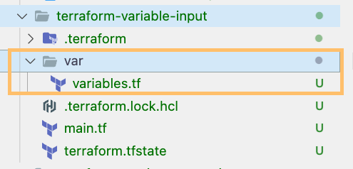

Use `terraform fmt` to format your Terraform code.

## Format Recursively

One thing to bear in mind is the `terraform fmt` command only worked for the current directory on where your command was executed.

Let's see the example below.



If you run the `terraform fmt` command under the directory of **terraform-variable-input**. The **variables.tf** inside the **var** subdirectory will not be formatted.

How can we format the whole directory and all subdirectories?

We can use the flag **--recursive** when we run terraform fmt. Refer the full command below.

```bash
terraform fmt --recursive
```

I hope this post does provide value to you and see you in the next one.

Thank you.
