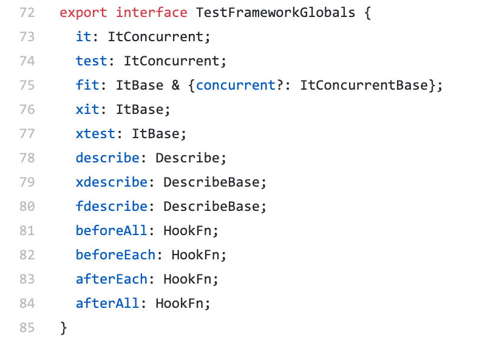

Have you ever wondered or confused about `test()` and  `it()` in Jest framework?

## Introduction

Personally, I have been using `it()` for quite some time. Recently, a thought of "Why both of `test()` and `it()` exists when they did the same job?" flashed through my mind. Thus, I decided to write this post and share some of my findings.

## Journey of Discovery

### Verifying The Truth

I have been told that `it()` and `test()` is behaving the same way and I decided to verify it. After some searching and read through the Jest [documentation](https://jestjs.io/docs/en/api#testname-fn-timeout). The documentation says:

> Also under the alias: it(name, fn, timeout)

Although the documentation already speaks for it, I decided to go straight to Jest [repo](https://github.com/facebook/jest) and navigate through the source code.

Finally, this piece of [code](https://github.com/facebook/jest/blob/f776624a7c50ec04307609bf67c7b103857caec2/packages/jest-types/src/Global.ts) tells me that both `it` and `test` is the same as they are using the same interface, `ItConcurrent`.

### Why we need both test() and it()?

As a logical thinker, I started to ponder is there a purpose or some special circumstances that lead to this situation? A situation where we have different functions but with similar functionality?

I found a pretty valid comment from [StackOverflow](https://stackoverflow.com/questions/45778192/what-is-the-difference-between-it-and-test-in-jest#comment78514071_45778192) (stated below as well).

> it might just be there for familiarity and migration from other frameworks. - Andrew Li

And once again, I decided to validate it.

### Examining other test frameworks

Thus, I begin with filtering out the 3 most popular Javascript Testing frameworks and they are listed below.

- [Mocha](https://mochajs.org/)
- [Jest](https://jestjs.io/)
- [Jasmine](https://jasmine.github.io/)

After some searching, Jest is the latest to enter the market among these JS testing frameworks. 

Mocha initial release was on 22 November 2011 and Jasmine is around the same time as well, between 2009 - 2011. 

These two frameworks also used `it()` instead of `test()`. 

## My Wild Guess

After the whole discovery process, I can make my wild guess with enough evidence. 

In order to make people effortlessly use Jest and reduce the learning curve by reuse a similar term. Thus, Jest team choose to expose `it()` as well.

Although `test()` sounds more intuitive and developers like it, but people who are familiar with Jasmine and Mocha can remain to use `it()` effortlessly.

## Conclusion

The process of discovery is fun and it's refreshing. The "Why" is the key to drive the whole discovery.

Last but not least, my wild guess could be wrong. If any members from Jest team knew the answer, please let me know.

I hope this post brings you some motivation and thanks for reading.

## Credits

Photo by [Ferenc Almasi](https://unsplash.com/@flowforfrank) on Unsplash