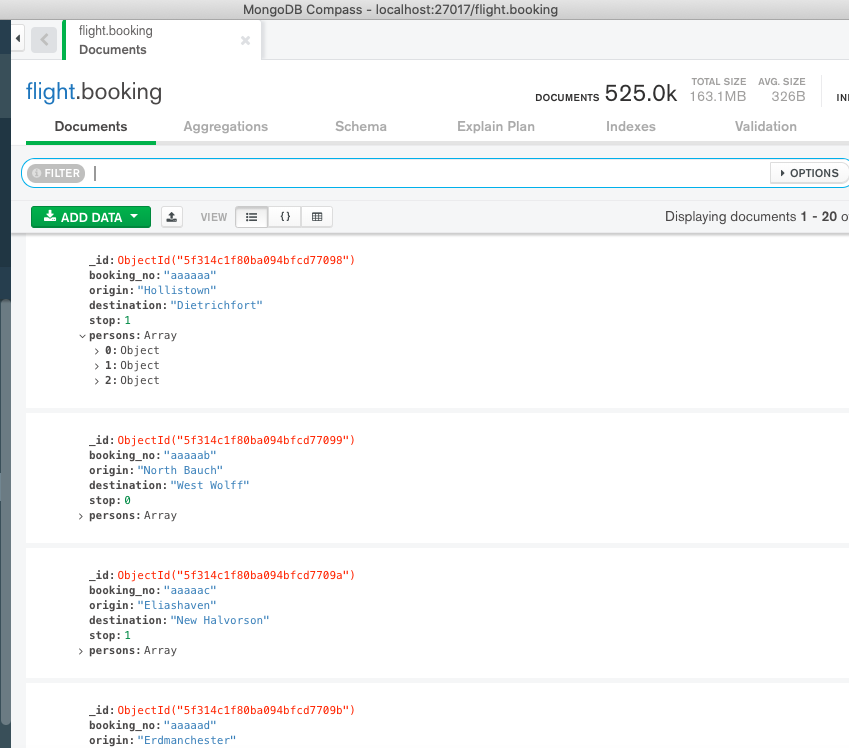
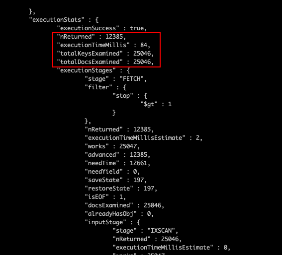
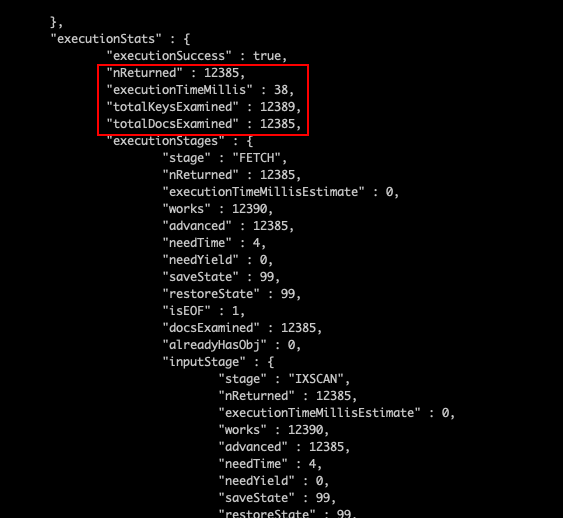

This post documented down how to improve the MongoDB query performance using index selectivity. At the end of this article, you will know the importance of index selectivity and how you can leverage it in improving query performance.

## Problem Statement

Let's explore the scenario we're facing currently. We have a flight database with `booking` collection. Refer to the screenshot below for the schema.



Given a flight database with `booking` collection, the admin from the flight company would want us to look into the query performance. Here is what the admin would do:

- Admin would like to know how all the flight booking to a specific destination where is more than 1 stop. The information that Admin would like to know is their respective `booking_no`, `origin` and `destination` and the number of `stop`.

Next, I will analyze and listed out what I need in order to carry out the research.

------

## Solution Analysis

I always started with finding out what I need in order to continue the research, these items are what I need:

- A collection with more than 500K documents in order to make the query time more significant.
- 25K bookings to destination “Gerlachmouth”.
- 12K bookings to destination “Gerlachmouth” which is more than 1 stop.

At the end of the article, we will know the importance of index selectivity in query performance.

Without further ado, let’s start the experiment to check with the performance.

------

## Performance Experiment

Before we started any experiment, let's ensure the setup is correct. There are no indexes created for the collection yet except the default `_id` field.

The experiment I would like to perform here are:

- Experiment 1 - Evaluate the Query Performance Using `destination` and `stop` index.
- Experiment 2 - How Index Selectivity affect Compound Indexes?

###Experiment 1 - Evaluate the Query Performance With Created Indexes

Before we start the query and evaluate the performance. let’s create an index for `stop` field.

Use the command below to create an index for `stop` field.

```javascript
db.booking.createIndex({ stop: 1 });
```

Next, we will see the performance where we query the bookings with destination “Gerlachmouth” and more than 1 stop. From the screenshot below, we can see that the query performance is not efficient as we are scanning through 262K index keys and documents and in the end it only returned 12K documents.

We only need 4% of what we examined and this is not cool. 👎👎


Now, let's try indexing the destination field. Use the command below to create an index for `destination` field.

```js
db.booking.createIndex({ destination: 1 });
```



The query performance where we use the destination indexes is way more performant compared to using the `stop` index we created above. Refer to the screenshot above, Now, we're only examing 25K index keys and documents which is almost 10 times lesser than the using `stop` index.

If you think about it, it is acceptable and pretty common sense too when we query using destination. The destination is way more specific compared to number of stops is more than 1. This is what we called **index selectivity** in MongoDB.

It means the higher the index selectivity, it is easier for MongoDB to narrow down the query results which equal to a significant improvement to the MongoDB performance. With this example, the execution time for this query is **7.6 times faster** compared to using `stop` index.

### Experiment 2 - How Index Selectivity affect Compound Indexes?

Until this stage, you might be thinking isn’t we can resolve this index selectivity by using Compound Index. We can create a compound index with both `stop` and `destination` field.

Let’s try it out by creating a compound index using the command below.

```javascript
db.booking.createIndex({ stop: 1, destination: 1});
```



From the screenshot above. the performance and execution time seems excellent compared to the index we created in Experiment 1. However, it is pretty weird that we’re examing 4 more keys compared to the total documents returned.

You might be thinking only it is only 4 more keys. But I have seen a scenario where 90K index keys were examined but only 10K documents returned. Thus, this isn’t very nice and we can fix it using the index selectivity theory.

Let's move on by creating compound index based on the strength index selectivity. We start with the strongest selectivity.

We can create index start with `destination` then followed by `stop` using the command below.

```javascript
db.booking.createIndex({ destination: 1, stop: 1 });
```

From the screenshot below, we achieved the index keys examined is equal to the number of returned documents. Although it is just a very small improvement that seems negligible in this example, it’s good practice to create index according to the index selectivity.


------

## Conclusion

Here are the key points of this article.

- Index Selectivity plays an important role in creating indexes. Stronger selectivity brings better query performance.
- Index Selectivity also has a significant impact on how we create Compound Index. Placing the stronger selectivity field 1st while creating a compound index allows us to examine lesser index keys.
- Lastly, create an index based on the strength of index selectivity. Remember **Equality, Sort, Range**. **Equality** provides the strongest selectivity while **Range** provides the least selectivity.

> Equality, Sort, Range - Index Selectivity Guide

Thank you for reading. See you in the next article.

## References

- Create Queries that Ensure Selectivity - MongoDB [Documentation](https://docs.mongodb.com/manual/tutorial/create-queries-that-ensure-selectivity/?jmp=university)
- MongoDB University Performance [Course](https://university.mongodb.com/courses/M201/about)