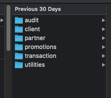

This post documented down all steps required to migrate your MongoDB to a new machine. At the end of this article, you will have a MongoDB with identical collections and documents compared to the previous machine. Without further ado, let's start.

## Problem Statement

It happened that I need to switch my development machine and I would need to migrate the data in my local MongoDB to the new machine. 

### Primary Objectives

- Avoid Wasting Time and Effort to Re-create Dummy Data in MongoDB. My projects are having 7-8 microservices and databases, each microservice has about 2-3 collections. Thus, I couldn't imagine if I am going to re-create those data.

Although my problem is specifically for data migration for the development machine, but I believe this article could help you as long as you're performing migration for MongoDB.

------

## Solution Analysis

The moment when I knew that I need to do this migration, I am a bit panicked as I have zero experience in doing MongoDB migration. It's important to remain calm (sometimes I couldn't) and resolves the problem bit by bit. I break this down into two parts:

- Backup the MongoDB data.
- Restore the data into the new machine.

------

## Backup MongoDB Data

We can use `mongodump` command to backup our own database. Open your terminal and run the following command you will be able to generate the dump file.

```bash
mongodump --host localhost:27017 --username USERNAME --password PASSWORD --authenticationDatabase admin --out  ~/Desktop/mongo-migration
```

I used the above command to backup all the database in the MongoDB. Below are the detail of the `mongodump` options:

- `--host` - Default value: localhost:27017. I declared explicitly here is to allow things to be clearer and better understanding towards each option.
- `--username` - Username used for authentication of MongoDB or Specific Database.
- `--password` - Password used for authentication of MongoDB or Specific Database.
- `--out` - The file directory where you want to save your dump file. By default, it saved under `dump` directory which located on the current directory.

Here is the output of my dump files. Refer to the screenshot below and each folder represent a DB.



------

## Restore MongoDB Data

At this stage, you already have your dump files directory in your new machine. Next, we can proceed to restore the MongoDB data.

Let's assume I saved my dump directory at this path `~/Downloads/mongo-migration`.

Now we can use the default root role we have in MongoDB to restore the database. Refer to the command below.

We can use this single command to restore all the database and you would have the exact same database like previously

```bash
mongorestore ~/Downloads/mongo-migration/ -u root --host 127.0.0.1:27017 --authenticationDatabase admin
```

### Restore Mutiple DB 

However, there could be a scenario where you only want to restore a few DBs and excluding a few DBs from the dump directory. 

For e.g, I want to restore `audit` and `client` table at this round. We can do this using `--nsInclude` and `nsExclude` option in `mongorestore`.

**Example of using --nsInclude**

We can use `--nsInclude` to select only the database and collections that we want to restore. In the command below, we restore all the collections in the audit database using `audit.*` and all collections in the client database using `client.*`.

The wildcard after the dot notation means all collections in the database. If you want to include or exclude multiple databases, you would need to specify it `nsInclude` or `nsExclude`. Refer to the example below.

```bash
mongorestore ~/Downloads/mongo-migration/ -u root --host 127.0.0.1:27017 --authenticationDatabase admin --nsInclude="audit.*" --nsInclude="client.*"
```

**Example of using --nsExclude**

We can use `nsExclude` to exclude the database and collections that we do not want to restore. In the command below, we exclude partner, promotions, transaction and utilities database.

```bash
mongorestore ~/Downloads/mongo-migration/ -u root --host 127.0.0.1:27017 --authenticationDatabase admin --nsExclude="partner.*" --nsExclude="promotions.*" --nsExclude="transaction.*" --nsExclude="utilities.*"
```

### Restore Single DB

Lastly, this is the command to restore the single DB. Few things to take note here:

- `-d` options - Specify the database name to be restored. This is a REQUIRED option.
- Specify the correct dump directory. For e.,g, if I am restoring `utilities` database, I must specify the utilities database dump directory.

Refer to the command below.

```bash
mongorestore -d utilities ~/Downloads/mongo-migration/utilities -u root --host 127.0.0.1:27017 --authenticationDatabase admin
```

------

### Conclusion

Here are the key points of this article.

- Discussed the details on how to backup the MongoDB using `mongodump`.
- Discussed the details on how to restore all database, multiple databases and single database using `mongorestore`

Thank you for reading. See you in the next article.

## References

- [Stack Overflow](https://dba.stackexchange.com/questions/113017/how-restore-a-specific-database-from-backup-using-mongorestore-command) on using mongorestore to restore the specific database
- mongodump Offical [Reference](https://docs.mongodb.com/manual/reference/program/mongodump/)
- mongorestore Official [Reference](https://docs.mongodb.com/manual/reference/program/mongorestore/)