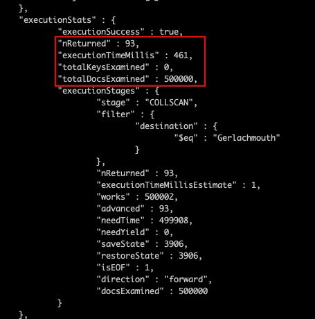
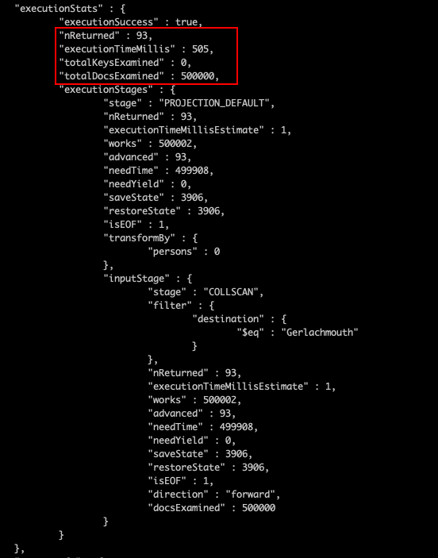
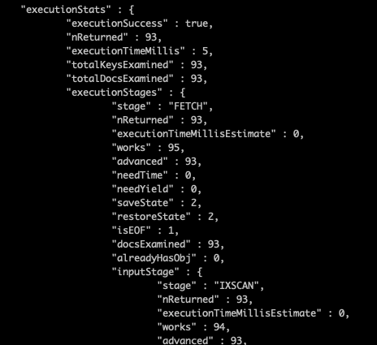
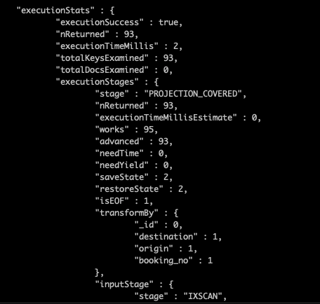

This article documented down all my findings and analysis on how much performance was improved using projection in MongoDB. At the end of this article, we will be able to know whether MongoDB query performance will be improved by leveraging projection.

Without further ado, let's start. 

## Problem Statement

This article was inspired during my working hour where I am using [projection](https://docs.mongodb.com/manual/reference/glossary/#term-projection) when I retrieving the data from MongoDB. If you don't know what is projection, projection is

> "A document given to a query that specifies which fields MongoDB returns in the result set." according to MongoDB's Official [Documentation](https://docs.mongodb.com/manual/reference/glossary/#term-projection).

It's like ordering a Big Mac at McDonald's, and we can choose a la carte instead of a full set that comes with drink and fries.

Thus, I was wondering how much actually does the query performance improved if projection was used. Here are the primary objectives that I want to achieve in this research.

### Primary Objectives

- Discover whether performance will be improved if projection was used in MongoDB query.
- Discover what is the best scenario to use projection in MongoDB query.

------

## Solution Analysis

I always started with finding out what I need in order to continue the research, these items are what I need:

- A collections with more than 500K documents, So I can found out the difference in query time with and without projection.
- Sub-document Schema. This is because I suspect the document with sub-documents will increase a significant amount of query time. Let's prepare this for the experiment as well.

Refer to the screenshot below for the outcome of data preparation. Check out this [article](https://medium.com/@tcguy/mongodb-performance-101-how-to-generate-millions-of-data-for-performance-optimization-cf45d3556693) on how I generate millions of dummy data for performance optimization.


From this screenshot, we knew that we have generated 500K documents with the following fields:

- `booking_no` - Booking Number for the Flight
- `origin` - Departure City
- `destination` - Arrival City
- `persons` - An array of People which consists of `first_name`, `last_name` and `dob` field

------

## Performance Experiment

Before we started any experiment, let's ensure the setup is correct. There are no indexes created the collection yet except the default `_id` field.

The experiment I would like to perform here are: 

- Experiment 1 - Will Query Performance Increased If I Project Lesser Fields?
- Experiment 2 - If Experiment 1 Result is No - Find out other scenarios on How Projection Improve Query Performance?

### Experiment 1 -  Will Query Performance Increased If I Project Lesser Fields?

Unfortunately, the answer is **No**. However, the performance will improve if those returning fields are all indexed and we will talk about this in the next section.

In this experiment, we're going to retrieve all the flight bookings in which the destination is "Gerlachmouth". Out of 500K bookings, there are 93 bookings where the destination is "Gerlachmouth". Let's examine how long it took to return these 93 documents.

I perform the performance analysis using Mongo Shell Explain function which enables us to discover the time spent on query and query strategy that was used.

```js
var exp = db.booking.explain('executionStats'); // Assign explain to exp to shorten the expression later
exp.find({ destination: 'Gerlachmouth'}); // Query bookings which desitnation is 'Gerlachmouth'
```



The above screenshot shows the result when retrieving without projection. The query took 461ms to complete. While the screenshot below shows the result where we leverage projection, the query took 505ms to complete.

Thus, the performance did not improve but instead, it took a much longer time to process the query when we use projection.



The conclusion for Experiment 1 -  Performance did not improve when you implement projection in the query. 👎👎

### Experiment 2 - If Experiment 1 Result is No - Find out other scenarios on How Projection Improve Query Performance?

Since my first hypothesis was wrong, then I try to do some research and re-visit the performance [course](https://university.mongodb.com/courses/M201/about) offered by MongoDB University. The course is free and goes check it out if you were interested in learning MongoDB Performance.

And I discovered Covered Query. Covered Query is a

> "query that can be satisfied entirely using an index and does not have to examine any documents". according to MongoDB's Official [Documentation](https://docs.mongodb.com/manual/core/query-optimization/#covered-query).

We can use the cooking metaphor to understand Covered Query. Imagine that you're cooking a meal with all the ingredients are ready and seated inside your fridge. Basically, everything is covered and you just have to cook it.

Before we create any indexes for the database, let's start by asking what is the field that we want to return to the application. Let's given the following scenario:

- Admin would like to know how all the flight booking to a specific destination. The information that Admin would like to know is their respective `booking_no`, `origin` and `destination`.

Given the scenario above, let's start by creating indexes. We can create two indexes.  

- Destination -Create an index on the destination field only
- Destination, Origin, and Booking No. We can create a compound index with the sequence `destination`, `origin` and `booking_no` field.

Refer to the command below on how to create the index.

```js
db.booking.createIndex({ destination: 1 }); 
db.booking.createIndex({ destination: 1, origin: 1, booking_no: 1 });
```

### Query Without Projection 

Firstly, let’s start query the booking where the destination is “Gerlachmouth”. The screenshot below shows the execution time for the query. As you can see, the total execution time reduced to **5ms**. It was almost **100 times faster** compared to without indexes.

You might be satisfied with such performance, but this is not the end of the optimization. We can improve the query performance, and make it **250 times faster** using **Covered Query** compared to without indexes.



### Query With Projection (Covered Query)

Using the covered query means we’re querying fields that are is indexed.

```js
exp.find({ destination: 'Gerlachmouth' }, { _id: 0, destination: 1, origin: 1, booking_no: 1  });
```

Using the above command, we able to optimize the query to **2ms**, which is around **60% faster** without using projection on the indexed field.

Aside from improving execution time, we also improve the query strategy. From the screenshot, we can see that we did not examine any documents, meaning the index itself already enough to satisfy the query. Thus, this improves the query performance overall as we don’t have to fetch the documents.



## Conclusion

Here are the key points of this article.

- Project lesser fields will not improve query performance unless all the returned fields can be satisfy using an index.
- An index can improve performance, but covered queries can level up your query performance.
- Covered Query performed 60% faster than Normal Optimized Query using Index Scan.

Thank you for reading. See you in the next article.

------

## References

- Projects Field From Query - MongoDB [Documentation](https://docs.mongodb.com/manual/tutorial/project-fields-from-query-results/)
- A Thorough Explanation from [StackOverflow](https://dba.stackexchange.com/questions/198444/how-mongodb-projection-affects-performance)
- Explain Output - MongoDB [Documentation](https://docs.mongodb.com/manual/reference/explain-results/#executionstats)

