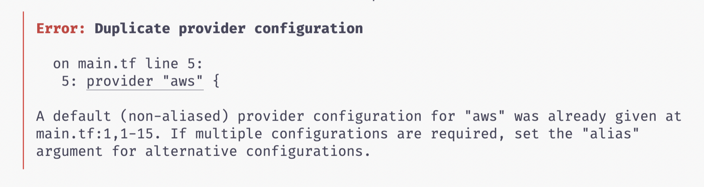

Running into `Duplicate provider configuration` in Terraform like the screenshot below?



This post will show you a detailed walkthrough of how to resolve it.

Let's get started.

## Why do I need to Know This?

It is normal to use AWS providers in different regions. For example, you have clients from both Asia and US, so deploying an application closer to your region will allow your customer to have a faster and better experience in network speed when using your application.

So, it will be good for us to know how to configure this.

## Sample Code

Before we begin, here is the TLDR version.

1. We will be using `alias` for the `providers` block so we could have multiple AWS providers in different regions.
2. Then we will be specifying the resource that is deployed in the `alias` region.

Let's start with the code that will give you the error. Then followed by the code that will fix the error.

In the sample code below:

- We declare two AWS `providers` with both different regions, `us-east-1` and `us-west-1`.
- We get the Ubuntu AMI ID using `data` block `aws_ami`
- We deploy two EC2 Instances with `resource`

```
provider "aws" {
  region = us-east-1
}

provider "aws" {
  region = us-west-1
}

# Get Ubuntu AMI Id
data "aws_ami" "ubuntu" {
  most_recent = true

  filter {
    name   = "name"
    values = ["ubuntu/images/hvm-ssd/ubuntu-focal-20.04-amd64-server-*"]
  }

  filter {
    name   = "virtualization-type"
    values = ["hvm"]
  }

  owners = ["099720109477"] # Canonical
}

# Create US East EC2 Instance
resource "aws_instance" "web-us-east" {
  ami           = data.aws_ami.ubuntu.id
  instance_type = "t3.micro"

  tags = {
    Name = "Hello-US-East"
  }
}

# Create US West EC2 Instance
resource "aws_instance" "web-us-west" {
  ami           = data.aws_ami.ubuntu.id
  instance_type = "t3.micro"

  tags = {
    Name = "Hello-US-West"
  }
}
```

However, if you run `terraform plan` or `terraform init` with the above code, you will encounter `duplicate provider configuration` error message.

Next, we can fix it by using `alias` in the provider block. It simply means that we give an alias to one of the AWS providers, so now both of the providers are no longer in conflict with each other as they have their unique names respectively.

### Full Working Code

Here are the changes I made to make it work:

1. Add `alias = "us-west"` for `us-west-1` provider in **Line 6**.
2. Add another `data "aws_ami"` block to get the AMI Id for Ubuntu US West 1
3. Add `provider = aws.us-west` in **Line 56**. The AWS Instance resource block.
4. Change the AMI Id in **Line 57** for the AWS instance resource block with the one that we created in step 2.

You can check the [diff](https://github.com/tlcheah2/terraform-exercise/commit/c19ccb825d97e99edbf41ef4e073e3d4489d8d6a) to have better visibility of what changes I have made.

```
provider "aws" {
  region = "us-east-1"
}

provider "aws" {
  alias  = "us-west"
  region = "us-west-1"
}

# Get Default Provider (US East) Ubuntu AMI Id
data "aws_ami" "ubuntu" {
  most_recent = true

  filter {
    name   = "name"
    values = ["ubuntu/images/hvm-ssd/ubuntu-focal-20.04-amd64-server-*"]
  }

  filter {
    name   = "virtualization-type"
    values = ["hvm"]
  }

  owners = ["099720109477"] # Canonical
}

# Get US West Ubuntu AMI Id
data "aws_ami" "ubuntu-us-west" {
  provider    = aws.us-west
  most_recent = true

  filter {
    name   = "name"
    values = ["ubuntu/images/hvm-ssd/ubuntu-focal-20.04-amd64-server-*"]
  }

  filter {
    name   = "virtualization-type"
    values = ["hvm"]
  }

  owners = ["099720109477"] # Canonical
}

# Create US East EC2 Instance
resource "aws_instance" "web-us-east" {
  ami           = data.aws_ami.ubuntu.id
  instance_type = "t3.micro"

  tags = {
    Name = "Hello-US-East"
  }
}

# Create US West EC2 Instance
resource "aws_instance" "web-us-west" {
  provider      = aws.us-west
  ami           = data.aws_ami.ubuntu-us-west.id
  instance_type = "t3.micro"

  tags = {
    Name = "Hello-US-West"
  }
}
```

I hope this post does provide value to you and see you in the next one.

Thank you.
