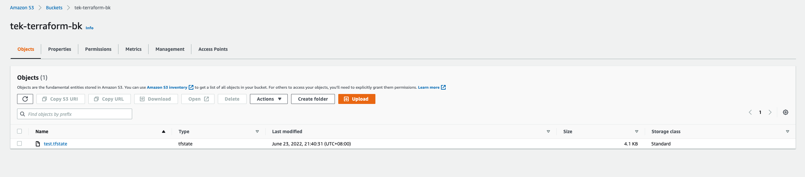

By default, Terraform stores the state file locally when the `terraform plan` command is executed.

The state was stored under a file named `terraform.tfstate`.

However, this isn't practical because it is not reliable. It's just like storing your code at a remote repository such as Github vs storing your code at your local machine.

Which do you feel more comfortable with? **100% for me is storing the code at a remote repository**.

## Store Terraform State Remotely

Since we made up our mind to store the state file remotely, the next question is where could we store this remote state? We have multiple options here such as:
- Terrafrom Cloud
- AWS S3
- Google Cloud Storage (GCS)
- many more.

In this post, I will be storing the remote state in Amazon S3 since it is one of the most popular cloud services in the world. 

Here is the TLDR version of the steps:
1. Configure `backend` in terraform block
2. Use `s3` as the backend
3. Configure the minimal 3 required fields within the `backend` block.

    - `bucket` - The bucket you have created in AWS S3 for storing the state file.
    - `key` - The path and name of the state file within the bucket
    - `region` - The region of the S3 Bucket
4. Run the usual terraform command, `init` and `apply`.

## Sample Code

In the below terraform file, I use docker provider to:
- Fetch the latest nginx image from Docker Hub.
- Use the fetched nginx image to create a docker container with the name of `tutorial`.
- Lastly, configure the backend `s3` block.

```
// main.tf
terraform {
  required_providers {
    docker = {
      source  = "kreuzwerker/docker"
      version = "~> 2.13.0"
    }
  }

  backend "s3" {
    bucket = "tek-terraform-bk"
    key    = "test.tfstate"
    region = "ap-southeast-1"
  }
}

provider "docker" {}

resource "docker_image" "nginx" {
  name         = "nginx:latest"
  keep_locally = false
}

resource "docker_container" "nginx" {
  image = docker_image.nginx.latest
  name  = "tutorial"
  ports {
    internal = 80
    external = 8000
  }
}
```

Below is the screenshot of the terraform state file being saved into the S3 bucket.



I hope this post does provide value to you.

Thank you.
