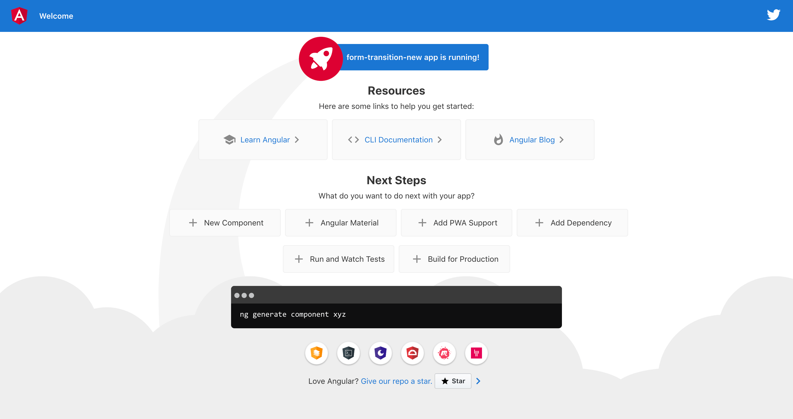
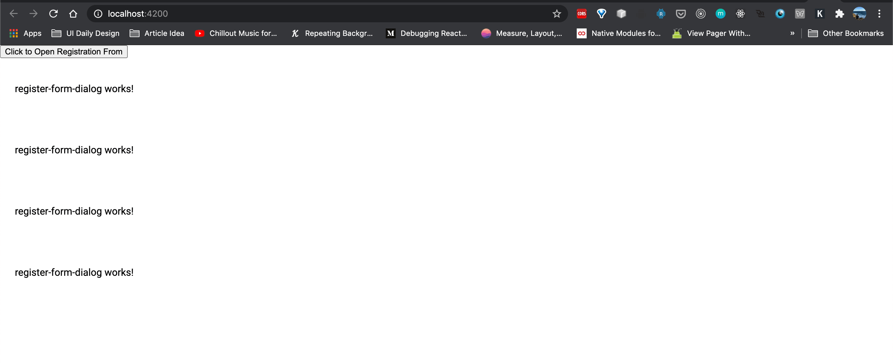

This post is a little bit special where I will share the step-by-step guide on how I did something wrong, spent an hour troubleshooting it, and how you can avoid it.

## Problem Background

This problem happened when I created a new Angular application and running `ng serve --open`. You will see the default screen like below.



**Installing Angular Material**

I open the second terminal window to install `angular/material` into my project using `ng add angular/material` command. Refer to the screenshot below.

```
tekloon:form-transition-new teklooncheah$ ng add @angular/material
Installing packages for tooling via npm.
Installed packages for tooling via npm.
? Choose a prebuilt theme name, or "custom" for a custom theme: Indigo/Pink        [ Preview: https://material.angular.io?theme=indigo-pink ]
? Set up global Angular Material typography styles? Yes
? Set up browser animations for Angular Material? Yes
UPDATE package.json (1316 bytes)
✔ Packages installed successfully.
UPDATE src/app/app.module.ts (502 bytes)
UPDATE angular.json (3996 bytes)
UPDATE src/index.html (520 bytes)
UPDATE src/styles.scss (181 bytes)
tekloon:form-transition-new teklooncheah$ 
```

------

After I import MatDialog and writing code to open the dialog, here is the screen where the Dialog did not have the pop-up feeling but instead it showing under the button after I clicked the "Click to Open Registration Form" button. Refer to the screenshot below.




## Mistake I did

I did not check over the 1st terminal where I run the `ng serve`. It is always advisable to check the console in your terminal whether there are error. I forget about this and the cost is spending more time.

If you check the terminal where you run `ng serve`. You shall see the following error.

>    This likely means that the library (@angular/material/dialog) which declares MatDialogModule has not been processed correctly by ngcc, or is not compatible with Angular Ivy. Check if a newer version of the library is available, and update if so. Also consider checking with the library's authors to see if the library is expected to be compatible with Ivy.

When you see this error, it's very possible that Angular did not compiled the Angular Material correctly.

## Solution and In-depth Explanation

> Restart the Angular application and the UI shall behave normally.

What happened when you restart the application? **It will re-compiles the Angular Material library and now it is available to be used.** 

Thus, the best practice is restart the application when you install new dependencies. 

Lastly, I hope this post did bring some value to you, and thanks for reading.


